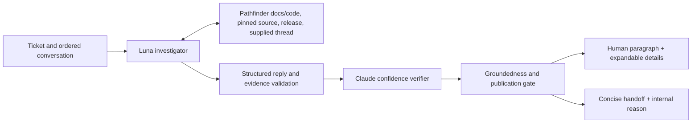

# Support reply agent

Support replies use the OpenAI Agents SDK (`@openai/agents`) with `gpt-5.6-luna` by default. The existing queue, platform adapters, one-response-per-ticket gate, feedback calibration, and durable escalation workflow remain in place.

## Configuration

Set `OPENAI_API_KEY` and `ANTHROPIC_API_KEY` on the worker and web service. Anthropic still handles independent confidence verification, ticket classification, and sentiment analysis. Keys must be configured through the deployment's secret mechanism, never committed.

- `AI_RESPONSE_PROVIDER=openai` selects the new agent; `anthropic` selects the legacy response generator.
- `AI_RESPONSE_MODEL` defaults to `gpt-5.6-luna` for OpenAI or `claude-sonnet-4-6` for Anthropic. Clear any explicit OpenAI model override when rolling back to Anthropic.
- `AI_LEGACY_RESPONSE_MODEL` controls direct legacy-generator use when the pipeline provider is OpenAI.
- `AI_DRAFT_LINT_MODE=report` records existing draft-rule violations. `enforce` routes blocking violations to review. Review false positives before enabling enforcement. Evidence/schema validation and groundedness checks are always enforced.
- `OPENAI_AGENTS_DISABLE_TRACING=1` disables SDK tracing. Otherwise traces exclude sensitive generation/tool payloads. Responses requests set `store: false`.

## Investigation and publication

The agent can make six read-only tool calls over at most eight model turns, with a 60-second run deadline. Retrieval is bounded to four results per search and 6,000 characters per source. Searches can select CopilotKit/AG-UI, docs/code, and v1/v2. When a version filter returns no matches, the tool performs one explicitly labeled unfiltered search; those results still require version verification. Source reads allow only the CopilotKit and AG-UI public repositories, resolving refs to pinned commits. Release reads require a specific tag. A missing GitHub path/ref/tag is returned as `not_found` so investigation can continue; API outages still raise errors. Main-branch code is not treated as release evidence.

The investigator and verifier receive the same question and ordered conversation with available author and timestamp metadata. `read_thread` reads the context supplied to the run; it does not fetch missing remote comments or assert that local history is complete.

The structured result separates `summary`, `details`, API version, applicability, supporting source quotes, and an internal handoff reason. Summaries are limited to 80 words. GitHub renders one `
` section; the web QA view uses a native disclosure with separately transmitted Markdown. Quotes and internal handoff reasons stay out of public replies.

The validator checks quote provenance, citation URLs, summary size, HTML, balanced code fences, and definite v1-deprecated/v2 evidence mismatches. These checks establish provenance, **not semantic correctness**. The independent verifier assesses the complete draft and retrieved excerpts, followed by deterministic groundedness checks. Unusable verification, low confidence, invalid output, or an intentional route yields a short public handoff and preserves the internal reason for durable escalation. Temporary provider/retrieval failures propagate so the queue can retry without consuming the reply slot.

## Verification and rollout

Tests exercise the real SDK against aimock HTTP responses, including the tool loop, malformed evidence, tool failures, budget exhaustion, structured rendering, verification failures, stream chunk boundaries, and the worker's existing delivery/escalation invariants. Fixtures verify behavior around model output; they do not measure Luna's real-world answer quality.

Before production rollout, run with `SHADOW_MODE=true` on the worker using configured API keys and compare the same historical issues with the legacy provider. Review false unsupported-feature claims, generation mixing, context use, added value, handoff rate, token use, and latency. Enable posting only after inspecting those shadow outputs. This change does not modify deployment settings or post replies to external threads.
